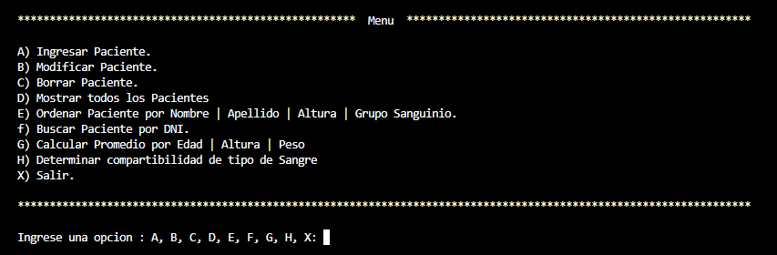
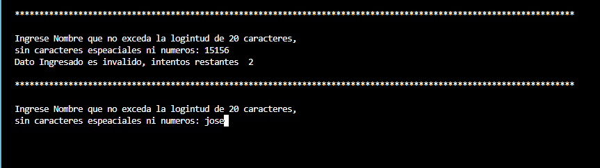
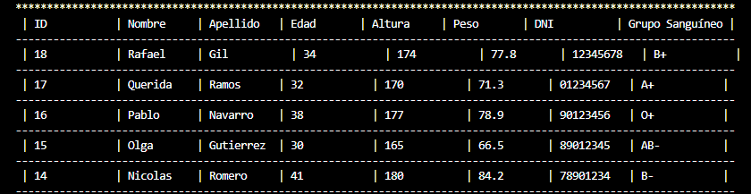

# Clínica Vidda

### Realizado por:
- Carlos Lopez - Comisión 111

## Descripción
Este es un programa para la administración de pacientes en una clínica privada que
permita interactuar únicamente a través de la consola. El mismo se realizo utilizando Python.

## Función principal
Desplega un menú de opciones para que el usuario pueda realizar las siguientes funciones: Dar de alta (ingresar un nuevo paciente), modificar, eliminar, mostrar todos, ordenar pacientes, buscar paciente por dni, calcular promedio, determinar compartibilidad.

## Descripción de opciones menú principal
A continuación paso a describir brevemente algunas opciones del menú principal, mostrar una imagen de la consola y un porción de codigo referente a esa opción:

- Ingresar paciente:     
Solicita los datos del paciente por diferentes input que validan los datos que ingresa el usuario.

~~~ Python (Lenguaje en el que esta escrito)

    elif claves == "Nombre" or  claves == "Apellido": 
        texto_input = f"Ingrese {claves} que no exceda la logintud de 20 caracteres,\nsin caracteres espeaciales ni numeros: " 
        valor = get_str(texto_input,False)

~~~
--
- Mostrar todos los pacientes:   
Se recorre una lista de diccionarios que se imprime y formatea, para mostrarla en forma de tabla con todos los datos del paciente, esta lista se obtine de datos.csv.

--

    Mostrar_lista_paciente() recibe una lista de diccionario la recorrre y muestra todos los elementos en formato de tabla, hace usos de otras funciones para obtener claves de un diccionario y dar formato y mostrar

~~~ Python (Lenguaje en el que esta escrito)
def mostrar_lista_paciente(lista:list[dict])->None:

    if type(lista) == list and  len(lista) > 0:
        lista_claves = obtener_claves_dict(lista[0])
        string_claves = convertir_a_str(lista_claves)
        print(string_claves)

        for empleado in lista:
            mostrar_paciente(empleado,False)
        base_tabla=convertir_a_str(False)                
        print(base_tabla)
~~~

## Link del proyecto
- [Proyecto](https://github.com/carlosgithub1506/PP_PROGRAMACION_I_111_LOPEZ)

## Link del video
- [Video](https://github.com/carlosgithub1506/PP_PROGRAMACION_I_111_LOPEZ)
